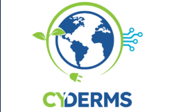

<p align="center">
  
</p>

# CyDERMS

**CyDERMS** stands for **Center for Cybersecurity & Resiliency of Distributed Energy Resources and Microgrids-integrated Distribution Systems**.

This repository consolidates models, datasets, posters, presentations, and reports for the CyDERMS project under the PowerCyber Lab at Iowa State University.

## Project Information

| Field | Details |
| --- | --- |
| Project Name | CyDERMS: Center for Cybersecurity & Resiliency of Distributed Energy Resources and Microgrids-integrated Distribution Systems |
| Funded By | U.S. Department of Energy, Office of Cybersecurity, Energy Security, and Emergency Response (CESER) |
| Grant Number | DE-CR0000040 |
| Lead Institution | Iowa State University |
| Principal Investigator | Dr. Manimaran Govindarasu (gmani@iastate.edu), Department of Electrical and Computer Engineering, Iowa State University |
| Website | https://cyderms.iastate.edu/ |

## Project Team

CyDERMS is led by Iowa State University with project partners from:

- Iowa State University
- University of Minnesota
- University of Illinois Urbana-Champaign
- Michigan Technological University
- Argonne National Laboratory
- National Laboratory of the Rockies
- GE Vernova

## Repository Purpose

Use this repository as the central project record for CyDERMS models, datasets, posters, presentations, and reports. Active project material should stay in this organization-owned repository rather than individual personal accounts so that project outcomes remain accessible to the lab over time.

## Folder Structure

```text
README.md
CONTRIBUTING.md
SECURITY.md
CODEOWNERS
cyderms-logo.png
models/
datasets/
posters/
presentations/
reports/
```

## Recommended Use

- `models/` - project models, simulation artifacts, model documentation, and reproducible modeling assets.
- `datasets/` - approved datasets or pointers to approved storage locations.
- `posters/` - conference posters and visual research summaries.
- `presentations/` - slides and briefing material.
- `reports/` - internal, sponsor-facing, and public reports.


## Acknowledgment

This work is funded in part by the US DOE Cybersecurity, Energy Security, and Emergency Response (CESER) Award Number DE-CR0000040.

## License

This repository is licensed under the MIT License unless otherwise stated. See `LICENSE` and `NOTICE.md` for details.

## Project Governance

Important changes should go through pull requests and review by a project lead or repository maintainer. Sensitive DOE or sponsor-facing content should remain private unless public release has been approved.

## Security Reminder

Do not commit passwords, API keys, private tokens, private system details, controlled information, or sponsor-sensitive material that is not approved for this repository.
